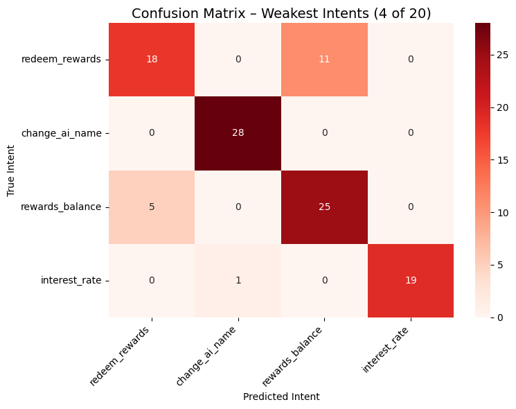

# Agent Assist Intent Classifier

  

**Traditional intent classification for real‑time coaching in contact centers**

This project demonstrates a core capability for an **Agent Assist** system: accurately identifying customer intent from live messages to trigger real‑time coaching suggestions. 

---

## 📌 Overview

- **Dataset**: CLINC OOS (20 randomly selected intents, 30 examples per intent)  
- **Model**: Traditional classifier – TF‑IDF vectorizer + Logistic Regression (multiclass)  
- **Evaluation**: Precision, recall, F1 – with business‑driven thresholds for “good”  
- **Output**: Confusion matrix, per‑intent performance, weak‑intent analysis  

**Key result**: **88% macro F1** on 20 intents with only 30 training examples per intent.

---

## 📊 Results

### Overall performance (20 intents)

| Metric     | Score |
|------------|-------|
| Accuracy   | 0.88  |
| Macro F1   | 0.88  |
| Macro Precision | 0.90  |
| Macro Recall    | 0.88  |

### Weak intents (F1 < 0.80)

| Intent             | Precision | Recall | F1   |
|--------------------|-----------|--------|------|
| redeem_rewards     | 0.78      | 0.60   | 0.68 |
| change_ai_name     | 0.55      | 0.93   | 0.69 |
| rewards_balance    | 0.69      | 0.83   | 0.76 |
| interest_rate      | 1.00      | 0.63   | 0.78 |

---

## 🔧 How to run

1. Open the Colab notebook [`Intent_Classification_Project.ipynb`](./Intent_Classification_Project.ipynb)
2. Run all cells in order.
3. The notebook loads CLINC OOS, selects 20 random intents, trains the classifier, and prints the report.
4. Visualizations (confusion matrix, bar chart) are generated inline.

---

## 🚀 Next steps / Improvements

- Merge semantically similar intents (e.g., `change_ai_name` and similar ‘change’ intents)
- Add a lightweight LLM (Gemini) to handle low‑confidence predictions
- Test with >100 examples per intent
- Deploy as a mock real‑time API endpoint

---

## 🧰 Technologies

- Python 3.12
- scikit‑learn (TF‑IDF, Logistic Regression)
- pandas, numpy
- matplotlib, seaborn
- Hugging Face Datasets (CLINC OOS)
- Google Colab

- [GitHub Repository](https://github.com/your-username/your-repo)
- [Colab Notebook](./Intent_Classification_Project.ipynb)
